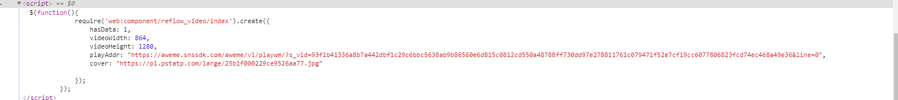

## 起因

 自己想保存一个抖音视频, 下载后有视频, 网页解析无水印视频需要付费


## 思路

1. 复制抖音分享地址 在浏览器中打开   发现js内有个播放地址

   

2. 将 playwm 替换为 play

3. 下载时发现还是有水印视频, 抖音手机端看视频没水印, 于是模拟手机端下载, 成功获取无水印视频

   

## 实现 

```python
def parsing_url(url):
    url = url[url.find("http"):url.rfind("/")]
    res = requests.get(url, headers=get_request_head(True), verify=False)
    bs = BeautifulSoup(res.text, features="html.parser")
    script = str(bs.find_all('script')[-1])
    video_json = demjson.decode(str(script[script.rindex(r"{"):script.index(r"}") + 1]))
    video_json["username"] = bs.find("p", class_="name nowrap").string.replace('@', '')
    video_json["playAddr"] = video_json["playAddr"].replace("/playwm/", "/play/")
    return video_json


def down_load(url, prefix):
    file_rs = requests.get(url, headers=get_request_head(False), verify=False)
    if not os.path.exists(prefix):
        os.makedirs(prefix)
    file_name = "{}\{}.mp4".format(prefix, time.strftime('%Y%m%d%a%H%M%S', time.localtime(time.time())))
    with open(file_name, "wb") as f:
        f.write(file_rs.content)


def get_request_head(isWeb):
    mobile_agent = "Mozilla/5.0 (Linux; U; Android 5.1.1; zh-cn; MI 4S Build/LMY47V) AppleWebKit/537.36 (KHTML, like Gecko) Version/4.0 Chrome/53.0.2785.146 Mobile Safari/537.36 XiaoMi/MiuiBrowser/9.1.3"
    web_agent ="Mozilla/5.0 (Windows NT 10.0; Win64; x64) AppleWebKit/537.36 (KHTML, like Gecko) Chrome/73.0.3683.103 Safari/537.36"
    headers = {
        'accept': 'text/html,application/xhtml+xml,application/xml;q=0.9,image/webp,image/apng,*/*;q=0.8',
        'accept-encoding': 'gzip, deflate, br',
        'accept-language': 'zh-CN,zh;q=0.9',
        'pragma': 'no-cache',
        'cache-control': 'no-cache',
        'upgrade-insecure-requests': '1',
        'user-agent': web_agent if isWeb else mobile_agent
    }
    return headers
```

