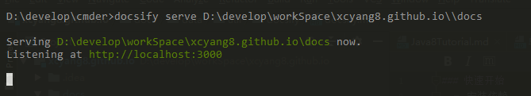
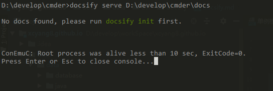

### 快速开始
  - 安装依赖 
      ```
      npm i docsify-cli -g
      ```
  - 初始化
    ``` 
    docsify init ./docs
    ```
  - 启动
    - 本地直接
    ```
    docsify serve D:\develop\workSpace\Yangcx5.github.io
    ```
    - 通过bat
    
    bat内容：
    ```
    docsify serve %~dp0\docs
    pause
    ```
    `%~dp0 `当前脚本存放目录  
    在别的路径执行bat
      
    
    `%cd%` cmd中当前路径  
    在别的路径执行bat  
    
    
### 部署
   [githubPage](https://docsify.js.org/#/deploy)
    
### [官网](https://docsify.js.org/#/quickstart)