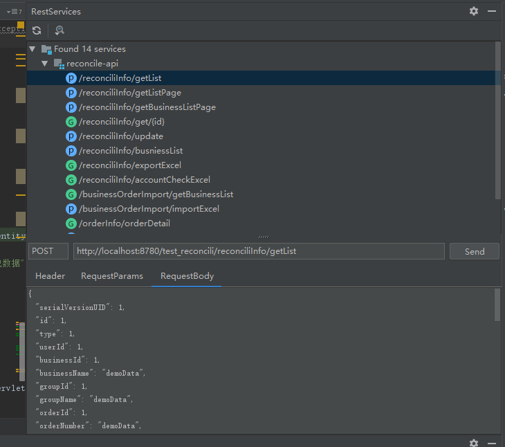
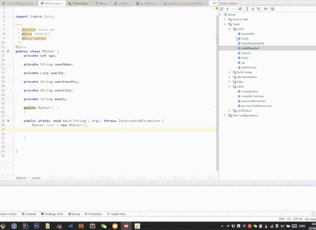
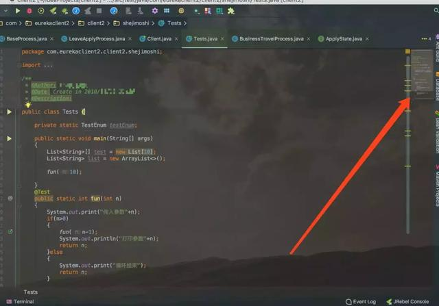
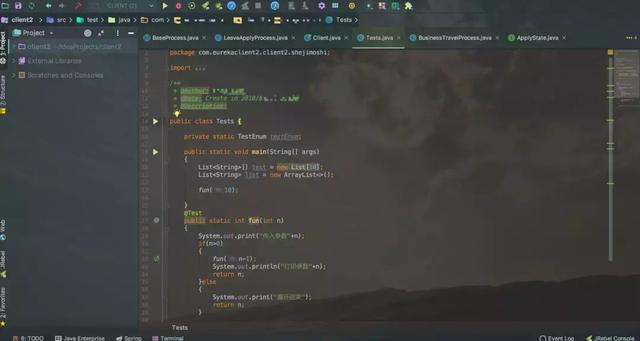
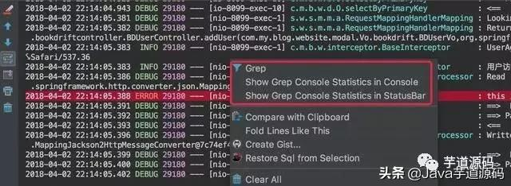
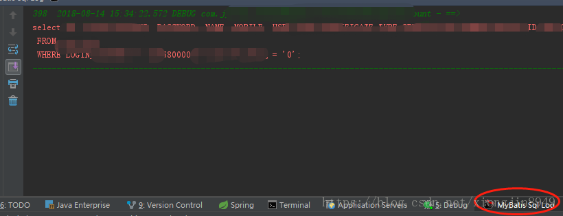

### 必备工具
- **RestfulToolki**

  生接口列表，提供搜索 快速定为接口位置，能测试

  

- **GenerateAllSetter**

   快速生成类的所有set

  

- **CodeGlance**

  代码整体预览

  

- **Background image Plus**

  背景图设置,拥有比较舒服的背景

  

- **.ignore**

  git提交时过滤掉不需要提交的文件，很方便，有些本地文件是不需要提交到Git上的。

- **FreeMyBatisPlugin**

  mapper和 xml 能快速跳转

- **Grep console**

  日志分色显示

  

- **MyBatis Log Plugin**

  将sql日志转换为可执行SQL

  

- **String Manipulation**

  驼峰式命名和下划线命名 转换