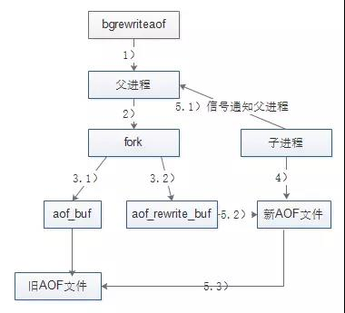

<!-- START doctoc generated TOC please keep comment here to allow auto update -->
<!-- DON'T EDIT THIS SECTION, INSTEAD RE-RUN doctoc TO UPDATE -->
**目录**

- [快照（snapshotting）持久化](#%E5%BF%AB%E7%85%A7snapshotting%E6%8C%81%E4%B9%85%E5%8C%96)
- [**AOF（append-only file）持久化**](#aofappend-only-file%E6%8C%81%E4%B9%85%E5%8C%96)
- [重写/压缩AOF](#%E9%87%8D%E5%86%99%E5%8E%8B%E7%BC%A9aof)
- [Redis 4.0 对于持久化机制的优化](#redis-40-%E5%AF%B9%E4%BA%8E%E6%8C%81%E4%B9%85%E5%8C%96%E6%9C%BA%E5%88%B6%E7%9A%84%E4%BC%98%E5%8C%96)

<!-- END doctoc generated TOC please keep comment here to allow auto update -->


非常感谢《redis实战》真本书，本文大多内容也参考了书中的内容。非常推荐大家看一下《redis实战》这本书，感觉书中的很多理论性东西还是很不错的。


**很多时候我们需要持久化数据也就是将内存中的数据写入到硬盘里面，大部分原因是为了之后重用数据（比如重启机器、机器故障之后回复数据），或者是为了防止系统故障而将数据备份到一个远程位置。**

Redis不同于Memcached的很重一点就是，**Redis支持持久化**，而且支持两种不同的持久化操作。Redis的一种持久化方式叫**快照（snapshotting，RDB）**,另一种方式是**只追加文件（append-only file,AOF）**.这两种方法各有千秋，下面我会详细这两种持久化方法是什么，怎么用，如何选择适合自己的持久化方法。


## 快照（snapshotting）持久化

Redis可以通过创建快照来获得存储在内存里面的数据在某个时间点上的副本。Redis创建快照之后，可以对快照进行备份，可以将快照复制到其他服务器从而创建具有相同数据的服务器副本（Redis主从结构，主要用来提高Redis性能），还可以将快照留在原地以便重启服务器的时候使用。


**快照持久化是Redis默认采用的持久化方式**，在redis.conf配置文件中默认有此下配置：
```

save 900 1              #在900秒(15分钟)之后，如果至少有1个key发生变化，Redis就会自动触发BGSAVE命令创建快照。

save 300 10            #在300秒(5分钟)之后，如果至少有10个key发生变化，Redis就会自动触发BGSAVE命令创建快照。

save 60 10000        #在60秒(1分钟)之后，如果至少有10000个key发生变化，Redis就会自动触发BGSAVE命令创建快照。
```

根据配置，快照将被写入dbfilename选项指定的文件里面，并存储在dir选项指定的路径上面。如果在新的快照文件创建完毕之前，Redis、系统或者硬件这三者中的任意一个崩溃了，那么Redis将丢失最近一次创建快照写入的所有数据。

举个例子：假设Redis的上一个快照是2：35开始创建的，并且已经创建成功。下午3：06时，Redis又开始创建新的快照，并且在下午3：08快照创建完毕之前，有35个键进行了更新。如果在下午3：06到3：08期间，系统发生了崩溃，导致Redis无法完成新快照的创建工作，那么Redis将丢失下午2：35之后写入的所有数据。另一方面，如果系统恰好在新的快照文件创建完毕之后崩溃，那么Redis将丢失35个键的更新数据。

**创建快照的办法有如下几种：**

- **BGSAVE命令：** 客户端向Redis发送 **BGSAVE命令** 来创建一个快照。对于支持BGSAVE命令的平台来说（基本上所有平台支持，除了Windows平台），Redis会调用fork来创建一个子进程，然后子进程负责将快照写入硬盘，而父进程则继续处理命令请求。
- **SAVE命令：** 客户端还可以向Redis发送 **SAVE命令** 来创建一个快照，接到SAVE命令的Redis服务器在快照创建完毕之前不会再响应任何其他命令。SAVE命令不常用，我们通常只会在没有足够内存去执行BGSAVE命令的情况下，又或者即使等待持久化操作执行完毕也无所谓的情况下，才会使用这个命令。
- **save选项：** 如果用户设置了save选项（一般会默认设置），比如 **save 60 10000**，那么从Redis最近一次创建快照之后开始算起，当“60秒之内有10000次写入”这个条件被满足时，Redis就会自动触发BGSAVE命令。
- **SHUTDOWN命令：**  当Redis通过SHUTDOWN命令接收到关闭服务器的请求时，或者接收到标准TERM信号时，会执行一个SAVE命令，阻塞所有客户端，不再执行客户端发送的任何命令，并在SAVE命令执行完毕之后关闭服务器。
- **一个Redis服务器连接到另一个Redis服务器：** 当一个Redis服务器连接到另一个Redis服务器，并向对方发送SYNC命令来开始一次复制操作的时候，如果主服务器目前没有执行BGSAVE操作，或者主服务器并非刚刚执行完BGSAVE操作，那么主服务器就会执行BGSAVE命令

如果系统真的发生崩溃，用户将丢失最近一次生成快照之后更改的所有数据。因此，快照持久化只适用于即使丢失一部分数据也不会造成一些大问题的应用程序。不能接受这个缺点的话，可以考虑AOF持久化。


## **AOF（append-only file）持久化**
与快照持久化相比，AOF持久化 的实时性更好，因此已成为主流的持久化方案。默认情况下Redis没有开启AOF（append only file）方式的持久化，可以通过appendonly参数开启：
```
appendonly yes
```

开启AOF持久化后每执行一条会更改Redis中的数据的命令，Redis就会将该命令写入硬盘中的AOF文件。AOF文件的保存位置和RDB文件的位置相同，都是通过dir参数设置的，默认的文件名是appendonly.aof。


**在Redis的配置文件中存在三种同步方式，它们分别是：**

```

appendfsync always     #每次有数据修改发生时都会写入AOF文件,这样会严重降低Redis的速度
appendfsync everysec  #每秒钟同步一次，显示地将多个写命令同步到硬盘
appendfsync no      #让操作系统决定何时进行同步
```

**appendfsync always** 可以实现将数据丢失减到最少，不过这种方式需要对硬盘进行大量的写入而且每次只写入一个命令，十分影响Redis的速度。另外使用固态硬盘的用户谨慎使用appendfsync always选项，因为这会明显降低固态硬盘的使用寿命。

为了兼顾数据和写入性能，用户可以考虑 **appendfsync everysec选项** ，让Redis每秒同步一次AOF文件，Redis性能几乎没受到任何影响。而且这样即使出现系统崩溃，用户最多只会丢失一秒之内产生的数据。当硬盘忙于执行写入操作的时候，Redis还会优雅的放慢自己的速度以便适应硬盘的最大写入速度。


**appendfsync no**  选项一般不推荐，这种方案会使Redis丢失不定量的数据而且如果用户的硬盘处理写入操作的速度不够的话，那么当缓冲区被等待写入的数据填满时，Redis的写入操作将被阻塞，这会导致Redis的请求速度变慢。

**虽然AOF持久化非常灵活地提供了多种不同的选项来满足不同应用程序对数据安全的不同要求，但AOF持久化也有缺陷——AOF文件的体积太大。**

## 重写/压缩AOF

AOF虽然在某个角度可以将数据丢失降低到最小而且对性能影响也很小，但是极端的情况下，体积不断增大的AOF文件很可能会用完硬盘空间。另外，如果AOF体积过大，那么还原操作执行时间就可能会非常长。

为了解决AOF体积过大的问题，用户可以向Redis发送 **BGREWRITEAOF命令** ，这个命令会通过移除AOF文件中的冗余命令来重写（rewrite）AOF文件来减小AOF文件的体积。BGREWRITEAOF命令和BGSAVE创建快照原理十分相似，所以AOF文件重写也需要用到子进程，这样会导致性能问题和内存占用问题，和快照持久化一样。更糟糕的是，如果不加以控制的话，AOF文件的体积可能会比快照文件大好几倍。

**文件重写流程：**

  
和快照持久化可以通过设置save选项来自动执行BGSAVE一样，AOF持久化也可以通过设置

```
auto-aof-rewrite-percentage
```

选项和

```
auto-aof-rewrite-min-size
```

选项自动执行BGREWRITEAOF命令。举例：假设用户对Redis设置了如下配置选项并且启用了AOF持久化。那么当AOF文件体积大于64mb，并且AOF的体积比上一次重写之后的体积大了至少一倍（100%）的时候，Redis将执行BGREWRITEAOF命令。

```
auto-aof-rewrite-percentage 100  
auto-aof-rewrite-min-size 64mb
```

无论是AOF持久化还是快照持久化，将数据持久化到硬盘上都是非常有必要的，但除了进行持久化外，用户还必须对持久化得到的文件进行备份（最好是备份到不同的地方），这样才能尽量避免数据丢失事故发生。如果条件允许的话，最好能将快照文件和重新重写的AOF文件备份到不同的服务器上面。

随着负载量的上升，或者数据的完整性变得 越来越重要时，用户可能需要使用到复制特性。

## Redis 4.0 对于持久化机制的优化
Redis 4.0 开始支持 RDB 和 AOF 的混合持久化（默认关闭，可以通过配置项 `aof-use-rdb-preamble` 开启）。

如果把混合持久化打开，AOF 重写的时候就直接把 RDB 的内容写到 AOF 文件开头。这样做的好处是可以结合 RDB 和 AOF 的优点, 快速加载同时避免丢失过多的数据。当然缺点也是有的， AOF 里面的 RDB 部分就是压缩格式不再是 AOF 格式，可读性较差。

参考：

《Redis实战》

[深入学习Redis（2）：持久化](https://www.cnblogs.com/kismetv/p/9137897.html)


