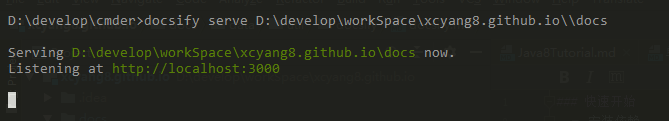
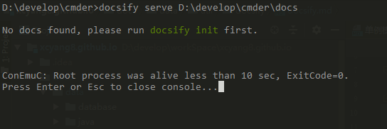

<!-- START doctoc generated TOC please keep comment here to allow auto update -->
<!-- DON'T EDIT THIS SECTION, INSTEAD RE-RUN doctoc TO UPDATE -->
**目录**

- [快速开始](#%E5%BF%AB%E9%80%9F%E5%BC%80%E5%A7%8B)
- [部署](#%E9%83%A8%E7%BD%B2)
- [插件](#%E6%8F%92%E4%BB%B6)

<!-- END doctoc generated TOC please keep comment here to allow auto update -->

### 快速开始
- 安装依赖

```
npm i docsify-cli -g
```

- 初始化

``` 
docsify init ./docs
```

- 启动
 - 本地直接
    
```
docsify serve D:\develop\workSpace\Yangcx5.github.io
```
    
- 通过bat   
bat内容：
    
```
docsify serve %~dp0\docs
pause
```

`%~dp0 `当前脚本存放目录  
在别的路径执行bat
  
    
`%cd%` cmd中当前路径  
在别的路径执行bat  

    
### 部署
   [githubPage](https://docsify.js.org/#/deploy)
   
### 插件
  - [pdf显示支持](https://github.com/lazypanda10117/docsify-pdf-embed)
  
```markdown
    ​```pdf
        path-to-the-pdf-file
    ​`.``
    
    三个点前面空两格,`.`` 中间多个点做转义
```
    
### [官网](https://docsify.js.org/#/quickstart)