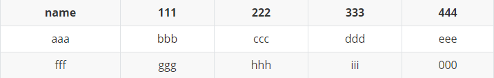
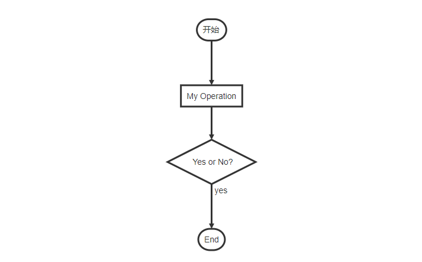

<!-- DOCTOC SKIP -->

### 目录生成

 ```Node.js
// 安装
npm install -g doctoc
// 用法
// 指定单个文件
doctoc xx.md
// 指定目录
doctoc .
//自定义TOC标题
doctoc --title **目录** . 或者  xx.md 后续不需要在指定标题
//指定最大目录级别
doctoc --maxlevel 3 . 或者 xx.md

下次运行将更新之前的目录结构 不是增加
 ```
 
doctoc文档：[https://github.com/thlorenz/doctoc](https://github.com/thlorenz/doctoc)

### 基础语法
 #### 标题
 示例：
```markdown
# 这是一级标题
## 这是二级标题
### 这是三级标题
#### 这是四级标题
##### 这是五级标题
###### 这是六级标题
```
 效果：


#### 字体
 示例：
 ```markdown
 **这是加粗的文字**
 *这是倾斜的文字*`
 ***这是斜体加粗的文字***
 ~~这是加删除线的文字~~
 ```
 效果:
 **这是加粗的文字**  
 *这是倾斜的文字*`  
 ***这是斜体加粗的文字***  
 ~~这是加删除线的文字~~  

#### 引用
 示例：
 ```markdown
 >这是引用的内容
 >>这是引用的内容
 >>>>>>>>>>这是引用的内容
 ```
 效果：
 >这是引用的内容
 >>这是引用的内容
 >>
 >>>>>>>>>>这是引用的内容

 #### 分割线
 三个或者三个以上的 - 或者 * 都可以。
 示例：

 ```markdown
    ---
    ----
    ***
    *****
 ```
  效果：

---
----
***
*****

#### 图片

  语法:
 ```markdown
 

 图片alt就是显示在图片下面的文字，相当于对图片内容的解释。
 图片title是图片的标题，当鼠标移到图片上时显示的内容。title可加可不加
 ```

 示例:
 ```markdown
 
 ```
   


#### 超链接

  语法：
 ```markdown
 [超链接名](超链接地址 "超链接title")
 title可加可不加
 ```

  示例：
 ```markdown
 [简书](http://jianshu.com "简书标题")  
 [百度](http://baidu.com)
 ```
  效果：

  [简书](http://jianshu.com "简书标题")  
  [百度](http://baidu.com)

#### 列表

  - **无序列表**  
    语法：无序列表用 - + * 任何一种都可以

  示例：
 ```markdown
 - 列表内容
 + 列表内容
 * 列表内容

注意：- + * 跟内容之间都要有一个空格
 ```
   - 列表内容
   + 列表内容
   * 列表内容

 - **有序**  
 语法：
 数字加点

示例：
 ```markdown
 1.列表内容
 2.列表内容
 3.列表内容

注意：序号跟内容之间要有空格
 ```
 1.列表内容  
 2.列表内容  
 3.列表内容  

 - **嵌套**  
 语法： 上一级和下一级之间敲三个空格即可
    示例：
  ```markdown
   - 一级无序列表内容1
      - 二级无序列表1
      - 二级无序列表2
   - 二级无序列表内容2
      1. 二级有序列表1
      2. 二级有序列表2
  ```
 效果：
   - 一级无序列表内容1
      - 二级无序列表1
      - 二级无序列表2
   - 二级无序列表内容2
      1. 二级有序列表1
      2. 二级有序列表2
      
#### 表格
 语法：
 ```markdown
name | 111 | 222 | 333 | 444
:-: | :-: | :-: | :-: | :-:
aaa | bbb | ccc | ddd | eee| 
fff | ggg| hhh | iii | 000| 
 ```

 ```
第二行分割表头和内容。
- 有一个就行，为了对齐，多加了几个
文字默认居左
-两边加：表示文字居中
-右边加：表示文字居右
 ```
 效果(网页不支持截图如下):  
 

#### 代码
 语法： 
 ```markdown
 单行：
 `代码内容`

 代码块：
 (```)
  代码...
  代码...
  代码...
 (```)
 ```

注：为了防止转译，前后三个反引号处加了小括号，实际是没有的。这里只是用来演示，实际中去掉两边小括号即可  


  示例：  
  `代码内容`
  ```markdown

 function fun(){
   echo "这是一句非常牛逼的代码";
 }
 fun();

  ```

#### 流程图

语法([参考](https://www.jianshu.com/p/02a5a1bf1096)):  

 ```markdown
 ```flow
 st=>start: 开始
 op=>operation: My Operation
 cond=>condition: Yes or No?
 e=>end
 st->op->cond
 cond(yes)->e
 cond(no)->op
 ```

示例：  
 网页不支持,截图如下
 
